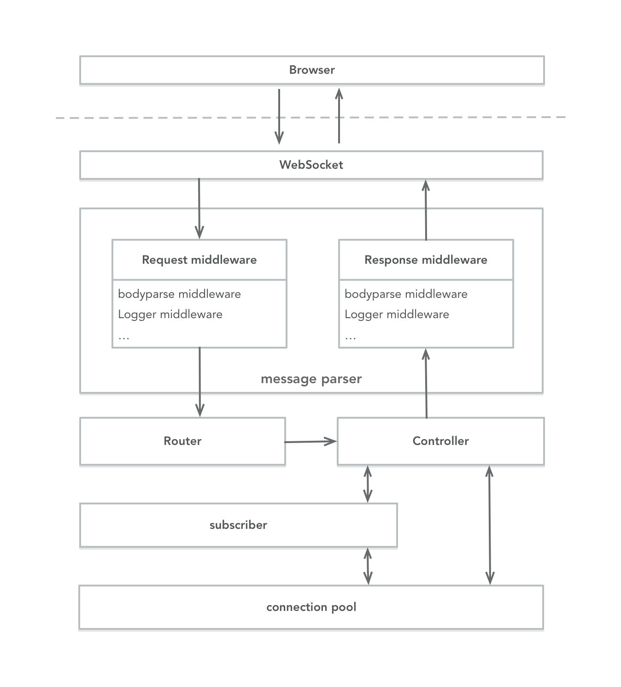
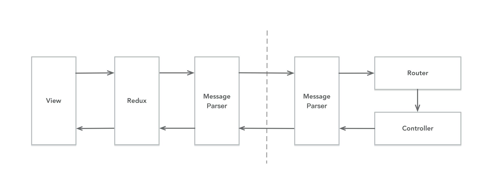
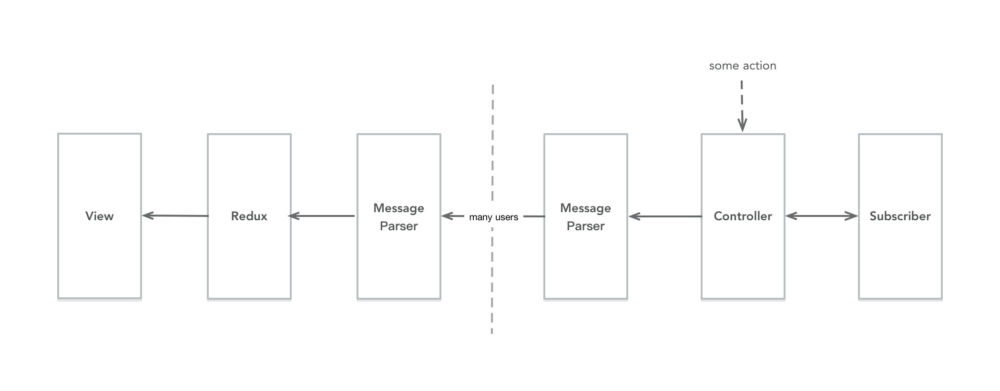
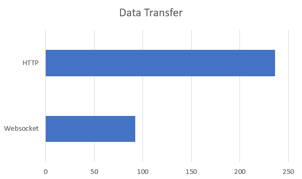

# Real-time single-page application development framework based on web sockets

## Abstract

The software based on the B/S architecture is a commonly used software mode. In this mode, the client and the server exchange data through the HTTP protocol. However, in the scenario where data is required in real time, that is, when the client needs to passively accept data, the HTTP protocol is not practical, because the HTTP request can only be initiated by the client, and then the server responds one by one. In order to solve this problem, the Websocket protocol was born. Its main feature is to establish a persistent link between the client and the server, enabling them to perform full-duplex communication. The protocol can effectively solve the problems currently faced, but the current web system is more to use Websocket in the place where real-time data needs to be transmitted. In many cases, the persistent link established by Websocket is not fully utilized. In fact, Websocket can also implement most of the functions of the HTTP protocol, but it requires additional difficulty and workload, and currently lacks mature solutions and libraries. So I plan to develop a Websocket-based web application development framework that takes full advantage of the features and benefits of websocket, and combines the popular single-page application development model to allow developers to quickly develop efficient and reliable web applications based on our framework.

## Introduction

### Background

At present, most of the web applications are based on the HTTP protocol and the data is exchanged by the client to initiate the request. This method can basically meet the functional requirements of most websites and is a very complete web application solution.With the popularization and rapid development of networks, data changes have become faster and faster. The real-time requirements of users' data have also become higher and higher. For web applications that require high real-time performance, HTTP-based communication is not practical. Because HTTP requests can only be initiated from the client, new data on the server side cannot be obtained by the client for the first time.To solve this problem, HTTP-based solutions mainly include polling, long polling, and Iframe streaming. The disadvantage of these three solutions is that it will waste a lot of internet resources and server resources.

The HTML5 standard defines a new communication method: WebSocket[1]. The purpose of this communication protocol is to solve the full duplex communication problem between the client and the server, and it has been widely supported in mainstream browsers. Currently websocket applications on the web mainly include real-time chat, real-time monitoring, and games. It turns out to be a very reliable technology.

Single-page application is a popular page development mode, which can complete the functions of multiple pages in one page, and has better performance and greatly enhances the user experience. If combined with WebSocket technology, real-time single-page web applications can be built to further increase efficiency and adapt to more complex data needs.

### Motivation

Currently, the application of WebSocket is not very extensive, and it is generally adopted in web applications in certain real-time scenarios. Compared to HTTP requests, the WebSocket mode is very different. In a complicated scenario, it will increase the difficulty of development, and it is also lacking mature solutions and references.

If the system uses websocket for communication without increasing the development complexity, and combined with the characteristics of the single-page application, the user's browsing experience will be much improved. In this mode, all functions are completed on one page, and all data interactions can be completed only by creating a websocket link on the front and back ends.

So I plan to develop a web system development framework for single-page application that base on WebSocket communication, providing a solution and development model for such applications, allowing developers to quickly develop functional and efficient real-time web applications.

### Current Methods

##### HTTP-based real-time communication

**polling**

The client sends a new HTTP request every short period of time. The server will return the result immediately whenever there is new data. This method will generate many invalid requests when there is no new data on the server, thus wasting bandwidth and server resources.

**long polling**

The server will not immediately return the client-initiated request without new data, but will be in the mounted state until there is new data and then respond to this request, or when the mount time reaches the server time limit, the server  will return immediately, telling the client to continue sending the next request, and so on. This scheme can reduce the number of HTTP requests compared to the "polling" scheme, but the server still needs to consume extra resources when handling the mount request, and it is difficult to manage and maintain.

**iframe stream**

The solution is to insert a hidden iframe in the page. The src attribute is a long link request. The server can continuously transfer data, and the client processes it through JavaScript to obtain continuously updated data. The disadvantage of this solution is still the need to spend extra resources on the server to maintain long connections.

##### Multi-page application

A multi-page application divides a web application into multiple html pages according to functions. Each page completes part of the function. The user needs to jump between multiple pages to complete the work. Every time the page jumps, it needs to re-request the html file and related css and JavaScript files, and then render. This is the most common mode of web application architecture. The disadvantage is that the jump between pages will result in a lack of coherence due to the need to re-download resources and re-render, affecting the user browsing experience, and adding additional HTTP requests and resources for page rendering again. Consumption, data between multiple pages is also difficult to share on the browser side, need to use services to maintain, thereby increasing the coupling of the front-end development. The advantage is that the development is simple and conducive to search engine search.

### Contributions

In my opinion, I intend to implement a single-page application web development framework based on websocket communication, so that developers can easily and efficiently develop high-performance, real-time web applications[3]. The main features of our framework are:

1. Our framework implements full-duplex communication between the server and the client. The server can easily initiate broadcast, multicast and unicast operations, and implements the HTTP protocol request method in a more efficient manner. These communication methods enable data transfer in a variety of situations, allowing our framework to meet the multiple functional requirements of the application.
2. In the case of frequent data interaction between the client and the server, our framework can significantly reduce the overhead of hardware resources and network resources, because it will only pass the required information when needed, without generating redundant requests and data.
3. Our framework can be combined with a variety of single-page application frameworks to simplify the real-time data update operation and achieve automatic and accurate update of the application interface, which not only improves the user experience, but also improves application stability and reduces development time.

## Related Work

### WebSocket

Most of the web applications are based on the HTTP protocol. It is simple and reliable. After years of development, it is very complete. However, because of its connectionless nature, it can only handle one request at a time, and it is disconnected after the processing is over. The server cannot initiate the request, but can only passively accept the request. In order to solve this problem, the IETF created the WebSocket communication protocol. Its main feature is to perform full-duplex communication on a single TCP link, so that both the client and the server can push data to each other. When the WebSocket establishes a link, the protocol is first negotiated and upgraded using the HTTP protocol, and subsequent data transmission is implemented through the WebSocket protocol. The process of establishing a WebSocket link is shown in the Figure 1.


After successfully establishing the link, the client and the server can perform two-way data communication at any time[5], and each subsequent communication can directly transmit the data text without carrying the complete header information, thereby further saving the bandwidth resources and supporting the development of the sub-protocol.

### React

React is an open source JavaScript library for building user interfaces and was born at FaceBook[2]. React encapsulates data and html into components one by one, thus forming a complete page. Then, by changing the component's state data, the corresponding html structure is automatically inserted, deleted, changed, etc. The developer does not need to pay attention to the DOM operation[4]. React can accurately implement complex DOM updates within the time complexity of O(n). Combined with the browser's history api, React can develop complex web applications. Users can therefore complete complexities without frequent page switching. Business needs. The core of React is virtual DOM technology and Diff algorithm.

##### Componentization

React encapsulates html code into individual UI components that can be nested together to form complex components that ultimately form the entire page and can be easily understood as an enhanced html tag. The following code is a component implementation that combines jsx syntax. This component is a class that inherits from React.Conponent. The render method returns the html tag to be rendered. This type of component can obtain the data passed by the parent component and can also be maintained. Your own data, while having lifecycle events and corresponding methods. Componentization makes the UI more flexible and easier to maintain.

```js
class HelloMessage extends React.Component {
  render() {
    return (
      <div>
        Hello {this.props.name}
      </div>
    );
  }
}
```

##### Virtual Document Object Model

React builds the DOM tree with JavaScript based on the updated state when the data is updated, then compares it with the last DOM tree, finds the two DOM trees different places, and finally updates the different places in the browser's real DOM. This can update the real DOM structure with minimal changes, thereby improving the performance of the page.

##### Diff Algorithm

Although the comparison of the DOM tree is performed in memory, the comparison operation is triggered frequently, so it is still necessary to ensure its high efficiency. The time complexity of directly finding the difference between two trees is O(n^3). React during the comparison process, from top to bottom layer by layer comparison, when the nodes of the same level are compared, if it is the same type of component, continue to hierarchical comparison, if the component types are different, directly replace the entire node and child nodes. This requires only traversing the tree once to complete the DOM tree alignment, reducing the algorithm complexity to O(n).

### Redux

Redux is an open source application state management JavaScript library that provides predictable state management. Redux's idea is to separate view and data, so as to achieve front end MVC pattern development [?], which can make the program more intuitive and low coupling. Redux can be used with a variety of UI libraries. When used with React, the front-end structure diagram is as shown Figure 2.


Our framework uses redux as a data manager. It is easy to synchronize the state of components at any time so that data can be predicted and maintained.

## Our framework

### Architecture

This framework is divided into a client part and a server part. Our framework contains two message communication mechanisms, namely, immediate messages and subscription messages. The former is a one-to-one message that uses websocket to implement HTTP-like requests. The basic idea of the latter is the publish and subscribe mode. The client automatically notifies the server of subscription content. The server informs the subscribed user when data is updated.

The client is a single-page application constructed based on react and redux. The action that carries the data triggers the update of the store. The store update triggers the automatic re-rendering of the view. The user initiates the action in the view upload, thus forming a closed loop. Our framework further packages the components of react so that when it is mounted and destroyed, it automatically informs the server through WebSocket to update the subscription relationship between the user and redux events. At the same time, the server implements an immediate message mechanism similar to an HTTP request on the basis of WebSocket, so that the client can initiate a request for immediate reply, the server has corresponding route matching and the controller processes the request, and can handle the active publishing logic of the service. That is, the message is pushed according to the user subscription event in the subscriber. The content of the message data is a redux action object, and the subscribed component can receive the message accurately and trigger the event automatically, thereby updating the store, and finally automatically updating the view. The system architecture is shown in the Figure 3.


##### Server Architecture

The server consists of message parsers, routes, controllers, subscribers, and connection pools. After receiving the message, WebSocket will process the request middleware in the message parser, and then construct a request object and send it to the matching route. The route will call the related controller to process the current request for business logic, for example, Database operations, etc. After processing, the controller can return content based on the user's subscription status in the subscriber and active user constructs in the connection pool. The returned content will still be processed through the middle layer returned by the message parser, and finally Send it to users via WebSocket. The architecture diagram shows in Figure 4.



The route mentioned in our framework is not a route in the traditional framework, but the same function is implemented. The role of the route is to match the path of the HTTP request and then respond. It is proved that this method can effectively give each HTTP Request to add a unique identifier. Our framework also learns from this approach by adding a header object to each message on the client. The object contains the url attribute. The server creates a routing mechanism based on the url so that the framework can handle a variety of websocket messages.

Combining middleware and routing can accomplish various business requirements. In order to implement the function of automatically pushing new messages, we use a subscriber to implement the user and its subscription relationship. The framework has a route with a value of /subsribe, and the route accepts the body as the redux event name. The request is added, and the current user and the subscription event are added to the subscriber, and the corresponding/unsubscribe route is to delete the current subscriber's subscription to the event in the subscriber. Developers can create any needed routes and controllers to implement the required functions, such as logging in, getting articles, and other data requests that need to be returned immediately. The client will ensure the same request and return through the unique identifier of the request.

##### Client Architecture

The client consists of three parts, the view, the state manager, and the WebSocket message processor. The front end of our framework is implemented in two sub-frameworks, namely jayce and jayce-dom, which can separate the view layer from the data processing layer to enable the use of multiple view frames, such as vue and angular. First, our framework generates a globally unique Jayce instance by passing in redux's store object and configuration information. This instance contains the WebSocket execution method and the redux event execution method. After the Jayce instance is instantiated, a WebSocket link will be established for the server-needed initiative. Pushing the contents of new data, the developer can write jayce-dom's jayceSubscribe method to wrap any component into a subscription component when writing the react component. This component will notify the server's current user to subscribe to the redux event during the life cycle, and destroy the component. Also requests the current user of the server to cancel the redux event subscription. For the immediate message, the user can call the send method of the Jayce instance to send the request to the server. The callback method will get the data returned by the server. The write is the same as the AJAX request. The front-end architecture is as shown in the Figure 5.


### Message Protocol

In addition to the files required for the initial rendering of the browser through the HTTP request, we allow all subsequent data interactions to be implemented through WebSocket, and different types of messages will have different processing logic, in order to ensure that different types of messages can be processed correctly and With the scalability of the system, we have established a simple protocol based on the WebSocket message. WebSocket transmission of data content is a string of text, in the message before passing, need to be parsed by the message parser. The sender constructs the request object in json format, and then converts it into a json string for transmission to the WebSocket. The receiver then parses it into a json object. Since both the client and the server are based on JavaScript, json can be processed directly. Each message object contains two attributes, header and body. The body is the data content. The header has two intrinsic properties: url and type. The former is the route identifier, which tells the server which route processor to use for processing. The latter is the request type. The frame has three built-in type messages:  Immediate messages, subscription messages, and unsubscribe messages. In addition, applications can also add other header information as needed.

### Automatic Subscription Component

React builds the browser DOM structure by writing components. Each component has its own lifecycle method. Our framework encapsulates the React component and the package is implemented using the `jayceSubscribe()` method. This method accepts two arguments. The first argument is an array of redux events to be subscribed to. The second argument is an instantiated Jayce object. Calling the `jayceSubscribe()` method returns an anonymous method accepting a react component as an argument. , Return the packaged Jayce component. Invoking the example:

```js
export default jayceSubscribe(['GET_NEW_ARTICLE'], jayce)(Article);
```

Which Article is the need to subscribe to the components, the final export is Jayce packaged components.
The Jayce packaging component process:

1. Create a new component
2. Perform a request subscription method in the lifecycle event of componentWillMount
3. Perform unsubscribe request method in lifecycle event of componentWillUnmount
4. Add components that need to be packaged as subcomponents
5. Return to this new component

### Subscriber

In order to enable the server to accurately and proactively push real-time data, the server needs to maintain a user's store subscriber. The subscriber saves the client's redux event and the user's use relationship, the data structure is a JavaScript object, the property name is the event name, and the value is the user connection object array that subscribes to the event, the built-in /subsribe and/unsubscribe routes of the framework and The related controller implements the automatic management of the subscriber, and does not need to care about the subscriber content for the developer. According to the business subscription and the publishing event, the corresponding user can automatically obtain the data and trigger the redux event.

### Message Parse

Message Parser is the hub of reliable communication between server and client. WebSocket is only a channel for establishing full-duplex communication between server and client. Therefore, we need a convenient and expandable message parsing function to enable these text messages to It is correctly identified and processed by the framework. Through the message protocol agreed above, on the server, Message Parser will register system-level and user-level middleware when the service is started. When receiving the message, Message Parser will construct the request object in json format according to the message content, and then submit a message. Each 'request' type of middleware is processed and finally reaches the route processor. When the server returns a message to the client, the returned message object will still be processed by the 'response' middleware in the message handler, and finally processed into a match message. The text content specified in the agreement is sent to the client by WebSocket.

### Middleware

Middleware is an important part of the framework. Every message flows through every middleware, so creating reasonable middleware can fulfill various business requirements, such as identity authentication, statistical analysis, message interception, and so on. A middle is a method that accepts two parameters. The first is the request object. The second is the method to execute the next middleware. After the middleware is registered in the framework, the middleware method receives the previous one. The middleware after processing the request object and the method to call the next middleware. The following is an example of a middleware for a build request object built into the framework. It is the first middleware in the request phase.

```js
function requestBodyParse(ctx, next) {
  let req = JSON.parse(ctx.message);
  if(req.header && req.body){
    ctx.req = req;
    next();
  } else {
    ctx.req = {
      header: {
        url: '/error'
      },
      body: ''
    }
    return;
  }
}

module.exports = requestBodyParse
```

The middleware converts the received message character into an object string according to the format specified by the message protocol. After processing, the next() method is called to execute the next middleware. If the conversion fails, it is passed to the framework's built-in /error routing process. Then call the use method on the framework instance object to register with the message parser.

### Process

In practical use, there are mainly three interaction modes between the server and the client. They are the message returned immediately after sending by the client, the message sent by the client to subscribe to the redux and unsubscribing event, and the message sent by the server to execute the redux event.

##### Immediate message

Most of the operations in a web application are immediate return operations, ie, immediate results, such as submitting a form, opening an article details page, etc. This kind of message needs to ensure that the request and return are in one-to-one correspondence. That is, each time the client sends a message, it will have a unique reply from the server, which is the same as the characteristics of the HTTP request. In order to achieve this feature, each time the client issues a message, it adds a unique identifier to the request object's header and adds it to the request waiting queue. After the server processes the request, it returns the message object carrying the identifier. After the client is returned, the client will be returned. Go to the request queue to find and execute related callback methods. The process is simplified as shown in Figure 6.



##### Automatic subscription

The automatic subscription message is automatically completed by the component. The component sends a message in the relevant life cycle method to notify the server to subscribe and unsubscribe the redux event, and then the service side updates the subscriber's subscription relationship to the redux event in the subscriber.The subscription process is shown in Figure 7.


The implementation of the subscription process is similar to the principle of the immediate message. The framework encapsulates the method of sending subscriptions and the routing controller. The subscription-related routing controller does not need to return a message after receiving the subscription request and directly updates the subscriber. Users can also override the subscription-related routing controllers or add additional subscriber routes for more flexible functionality.

##### Server push

Triggering the server's active push operation can come from a variety of behaviors, such as other users submitting data operations, server-side timing tasks, and so on. The process is shown in the Figure 8.



As long as you can get the framework instance object, you can call the instance at any time in the required logic to trigger broadcast, multicast, and unicast operations.

## Experimental results 

Compared to HTTP mode web applications, the main advantage of our framework is to achieve full-duplex communication and smaller data transfer between the client and server. So we compare the performance of the HTTP server and our framework server through two experiments[6]. The server is hosted on aliyun single core processor and 1G RAM, the client is run on Intel Core i7-8550U and 8GB of RAM in the chrome browser.

Express is a lightweight Node.js-based HTTP protocol server framework. We use our framework and express framework to build two server applications. The client requests the same json data text from the server through HTTP and Webscoket respectively.

### Data transfer

First, we compare the amount of data transmission under the two modes. After websocket establishes a link, each request only passes the message content. Instead of passing the complete header information such as HTTP, the amount of data transmission of the former is expected to be smaller than the latter.The Figure 9 is a comparison of both.



### Request pre second

Then we compare the concurrent capabilities of the two modes. We simulated the number of requests that the 100 users responded to each request for different numbers of requests. Figure 10 shows the results of each user's test when they initiated 1, 50, and 100 requests. The websocket test result includes the websocket creation phase.


When each user only initiates one request, HTTP responds twice as fast as websocket. Since websocet is not released immediately after it is established, the server needs to consume resources to maintain these links. However, as the number of requests from each user increases, the advantages of websocket are reflected. Frequent requests allow websocket to make full use of the established links and transfer data with minimal overhead. When the number of requests per user reaches 500, the server resources of both are completely consumed, so the number of request processing cannot be further improved.

## Conclusions

This article introduces a single-page application development framework based on WebSocket. In an environment where real-time requirements are becoming higher and higher and single-page applications have become mainstream development methods, our framework provides developers with a solution that satisfies both requirements. The solution and implementation can enable developers to quickly and efficiently develop real-time single-page web applications, greatly improving the user experience, and for the HTTP data acquisition method, our framework also supports it to meet a variety of functional requirements. Experiments have proved that our framework can effectively reduce the bandwidth, server and other resource consumption, thereby reducing the operation and maintenance costs. In order to adapt to rapid technological changes, our framework minimizes the coupling of modules. For example, developers can rewrite component wrappers to match various view frameworks, and can also replace subscribers with redis database.

Our framework replaces most of the HTTP requests with websockets. Although the underlying changes are relatively large, there is little change for developers from traditional web application development models. Our framework maintains routes, controllers, requests, returns, connection pools, etc. Related concepts and functions, learning is simple but powerful.

## References

[1]February. The WebSocket protocol[J]. 2011.
[2]Speaker-Hunt P, Speaker-O'Shannessy P, Speaker-Smith D, et al. React: Facebook's Functional Turn on Writing JavaScript[J]. Queue, 2016, 14(4):40.
[3]Pimentel V, Nickerson B G. Communicating and Displaying Real-Time Data with WebSocket[J]. IEEE Internet Computing, 2012, 16(4):45-53.
[4]Yan X Q, Bai J F. React Refresh Mechanism Analysis Based on Virtual Dom Diff Algorithm[J]. Computer Knowledge & Technology, 2017.
[5]Rao S S, Vin H M, Tarafdar A. Comparative Evaluation of Server-push and Client-pull Architectures for Multimedia Servers[C]// 1996:45--48.
[6]Subraya B M, Subrahmanya S V. Object driven performance testing of Web applications[C]// Quality Software, 2000. Proceedings. First Asia-Pacific Conference on. IEEE, 2000:17-26.