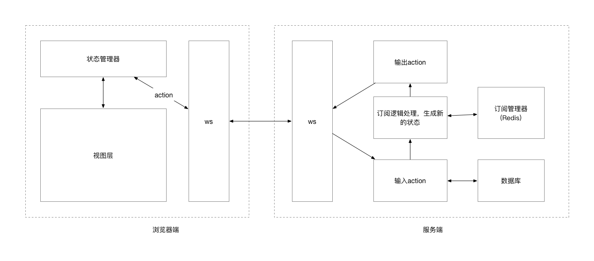

# 完全用websocket通讯的基于nodejs的web系统框架

## Introduction

### Background

### Motivation

### Current Methods

- HTTP
- 轮询
- 局部使用websocket

### Contributions

方便、利与开发的、基于node.js的前后端双向通行的框架

## Related Work

### B/S

### websocke

## Our framework

### Architecture

##### 浏览器端架构

##### 服务端架构

### Process

##### 浏览器主动请求流程

##### 服务端主动推送流程

### 订阅器

保存所有用户的订阅state，当对应state发生更新时，服务端主动通知这些客户端。

### Message Parse

所有的websocket消息都会经过Message Parse进行解析，构建对应的事件对象

### 事件模型

服务端接受到的事件模型

type：事件类别

- 私人事件
- 广播事件
- 群组事件

data 数据体
