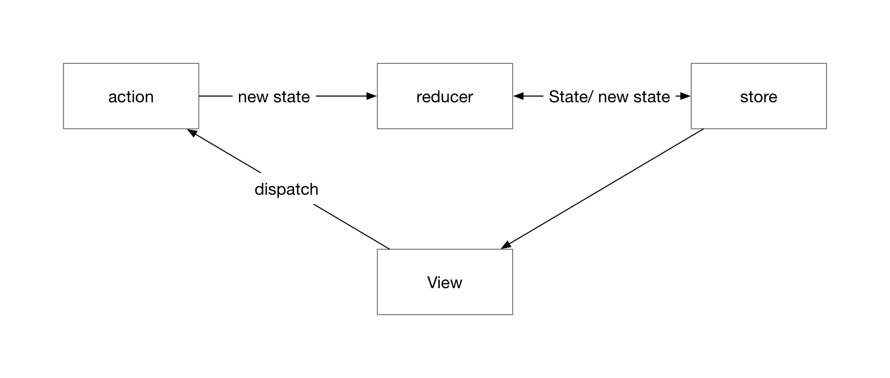

# 基于websocket的实时单页应用开发框架

## Introduction

### Background

目前绝大部分web应用的都是基于HTTP协议，由客户端主动发起请求的方式进行数据的交互，这种方式在基本上能满足大部分网站的功能需求，但是在对实时性要求较高的web应用上，基于HTTP通讯的方式就不太实用，因为HTTP请求只能从客户端主动发出，基于HTTP的解决方案主要有轮询、长轮询和Iframe流。这种三种解决方案缺点就是会浪费很多贷款或者服务器资源。

HTML5标准中定义了新的通讯方式：WebSocket，目的是为了解决客户端和服务端之间的双向通讯问题，而且在主流浏览器中得到了广泛的支持。目前websocket在web上的应用主要有实时聊天、实时监控、游戏等。现在网络已经非常发达，互联网数据越来越大，变化越来越快，用户对数据的实时性要求也越来越高，所以用户对web应用的实时性需求也会越来越多。

单页应用是现在web开发的一个主流解决方案，它可以在一个页面中完成传统web应用中多个页面才能完成的复杂功能，而且性能更好，大大提升了用户体验。如果结合WebSocket技术，可以构建出的实时单页web应用，能够进一步提升效率，适应更多复杂的数据需求。

### Motivation

现在WebSocket的应用还不是非常广泛，一般在特定实时场景下才会在web应用中部分采用，相对HTTP请求，WebSocket模式有很大不同，在过于复杂的场景下，会增加开发难度，而且也缺少相对成型的解决方案和参考资料。

如果在不增加太多开发复杂度的情况下全站采用websocket进行通讯，并结合单页应用的特点，能够使web的体验会提高很多。在这种单页应用+websocket模式下，一个页面就完成所有功能，前后端只需要建立一个websocket链接就可以完成所有的数据交互。

所以我打算开发出一个单页应用+WebSocket通讯的web系统开发框架，让开发者可以快速开发出功能复杂的、高效的实时web应用，提供一个此类应用的解决方案和开发模式

### Current Methods

##### 基于HTTP的实时通讯方案

**轮询**

客户端在每隔一段较短的时间发送一次新的HTTP请求，服务器无论是否有新的数据都会立即返回结果。这种方式在服务端没有新的数据的时候会产生很多无效的请求，而且服务端需要处理非常的请求，从而浪费带宽和服务器资源。

**长轮询**

客户端发起的请求，服务端在没有新的数据下不会立即返回，而是挂载状态，直到有新的数据的时候再响应这次请求，或者挂载时间达到服务器超时时间限制时候，立即返回，告诉客户端继续发送下一个请求，如此循环。这种方案相对“轮询”方案可以减少HTTP请求次数，但是服务端在挂载请求的时候，依然需要消耗额外的资源，而且难以管理维护。

**iframe流**

该方案是在页面中插入一个隐藏的iframe，其src属性是一个长链接[?]请求，服务端可以不断的传入数据，客户端通过JavaScript进行处理，从而获取到持续更新的数据。这种方案的缺点依然是需要花费服务端额外的资源去维护长连接。


##### 多页面应用

多页面应用是将一个web应用根据功能划分成多个html页面，每个页面完成部分功能，用户需要在多个页面之间跳转完成工作。每次页面跳转需要重新请求html文件以及相关的css和JavaScript文件，然后进行渲染。多页应用缺点是页面跳转会影响用户体验，而且会增加额外的HTTP请求和页面再次渲染的资源消耗，优点是开发简单，利于搜索引擎检索。

### Contributions

我所我打算实现一个基于websocket通讯的单页应用Web开发框架，简化websocket的开发，

1.	全新的web开发模式，不需要约定繁琐的http请求接口
2.	降低websocket的开发复杂度
3.	前后端可以主动推送数据
4.	数据交互速度更快，更加节约资源
5.	能够更加简单快速的开发出适合更多场景的web应用，甚至是app应用


## Related Work

### WebSocket

绝大部分的web应用都是基于HTTP协议的，他简单可靠，经过多年发展，现在非常完善，但是由于其无连接的特点，所以每次只能处理一个请求，处理结束之后便断开，而且服务端无法主动发起请求，只能被动的接受请求。为了解决这个问题，于是IETF创建了WebSocket通讯协议，其主要特点是在单个TCP链接上进行全双工通讯，使得客户端和服务端都能够互相主动的推送数据。WebSocket建立链接的时候首先采用HTTP协议进行协商升级协议，后续数据传输再通过WebSocket协议去实现。建立WebSocket链接的过程如图所示。


成功建立链接后客户端和服务端就可以随时进行双向数据通信，后续每次通信都不需要携带完整头部信息，更加节省带宽资源，而且还支持拓展子协议

### React

React是用于构建用户界面的开源JavaScript库，诞生于FaceBook的工程师。React将数据和html封装成一个一个的组件，从而构成完整的页面，然后通过更改组件的state数据，使对应的html结构自动实现插入、删除、更改等操作，让开发者不需要关注DOM的操作，便能开发出功能复杂的单页面应用。React的核心是虚拟DOM技术和Diff算法。

##### 组件化

React将html代码封装成独立的UI组件，组件之间可以相互嵌套构成复杂的组件，最终构成整个页面，如下代码是一个简单的组件的实现。组件化让UI更加灵活，易于维护。

```js
class HelloMessage extends React.Component {
  render() {
    return (
      <div>
        Hello {this.props.name}
      </div>
    );
  }
}
```

##### 虚拟DOM

React在数据更新的时候，根据更新后的状态用JavaScript构建DOM树，然后跟上次DOM树进行对比，找到两棵DOM树不同的地方，最后在浏览器真实DOM上对不同的地方进行更新，这样能够以最小改动去更新真实DOM结构，从而提高页面的性能。

##### Diff算法

DOM树的比对虽然是在内存中进行，但是比对操作会在频繁的触发，所以依然需要保证其高效性。直接找出两棵树的不同处的时间复杂度是O(n^3)。React在比对过程中，从上到下逐层比较，同一层级的节点比较时，如果是同一类型的组件，继续进行分层比较，如果组件类型不同，直接替换整个节点及子节点。这样只需要遍历一次树，就可以完成DOM树的比对，将算法复杂度降低到O(n)。

### Redux

Redux是一个开源的应用状态管理JavaScript库，提供可预测化的状态管理，可以配合多种UI库，在配合React使用的时候，其前端结构图如下图所示。我们的框架采用redux进行数据管理器，在任何时候都可以方便的对组件的状态进行同步。



## Our framework

### Architecture

本框架分为客户端部分和服务端部分，客户端框架取名为Jayce，服务端称作为Jayce-server，其关系如图所示。框架基本实现思想是发布和订阅，客户端自动通知服务端订阅内容，服务端在有数据更新的时候通知订阅的用户。

客户端是基于react和redux构建的单页应用，action触发store的更新，store更新触发视图的自动重新渲染，用户在视图上传发起action，从而形成一个闭环。我们框架在对react的组件进一步包装，使其在挂载和销毁的时候自动通过WebSocket通知服务端更新用户和redux的事件之间的订阅关系。同时服务端在WebSocket基础上实现了类似HTTP请求的立即消息机制，使得客户端可以发起能得到立即回复的请求，服务端有对应路由匹配和控制器处理请求，并可以处理发布的逻辑，即根据订阅器的用户即订阅事件进行消息推送，消息内容是需要触发的redux事件，被订阅的组件能够准确的收到消息并自动触发事件，从而更新store，最终自动更新客户端视图。


##### 客户端架构

客户端主要包括三个部分，视图、状态管理器和WebSocket消息处理器。

视图是用React实现，


##### 服务端架构

### 消息协议

除了浏览器初次渲染需要的文件通过HTTP请求外，我们让后续的所有的数据交互都通过WebSocket实现，而不同的类型的消息会有不同的处理逻辑，为了保证不同类型的消息能够被正确处理以及系统的可拓展性，所以我们在WebSocket的消息基础上建立了一个简单的协议。WebSocket传输的数据内容是字符串文本，在进行消息传递前，都需要经过message parser进行解析。发送端封构造json格式的请求对象，然后转换成json字符串交给WebSocket传输，接收端再解析成json对象，由于客户端和服务端都是基于JavaScript开发，所以json能够直接被处理。每个消息对象包含两个属性，header 和 body。header

### 自动订阅组件

React通过编写组件的方式去构建浏览器DOM结构，每个组件都有自己的生命周期方法，我们框架在React组件的基础上进行了封装，封装通过`jayceSubscribe()`方法实现。该方法接受两个参数，第一个参数是需要订阅的redux事件数组，第二参数是实例化的Jayce对象，调用`jayceSubscribe()`方法后返回的是一个匿名方法，接受一个react 组件为参数，返回包装后的Jayce 组件。调用示例：

```js
export default jaycesubscribe(['GET_NEW_ARTICLE'], jayce)(Article);
```
其中Article为需要订阅的组件，最终导出的是经过Jayce包装的组件。
Jayce包装组件的过程：

1. 创建一个新组件
2. 在componentWillMount的生命周期事件里执行请求订阅方法
3. componentWillUnmount的生命周期事件里执行取消订阅请求方法
4. 添加需要被包装的组件作为子组件
5. 返回这个新组件

### 订阅器

客户端在不同的页面下对数据有不同的实时性要求，所以服务端需要维护一个所有在线用户的store订阅器，从而保证数据的精确、有意义的推送。当对应store发生更新时，服务端需要主动推送更新的数据到这些客户端。

##### 存储结构

存储结构为一个对象数组，每个对象记录一个store以及订阅者数组。

### Message Parse

所有的websocket消息都会经过Message Parse进行解析，构建对应的事件对象

### middleware

中间件

### 事件模型

服务端接受到的事件模型

type：事件类别

- 私人事件
- 广播事件
- 群组事件

data 数据体

### Process

##### 自动订阅流程

##### 浏览器主动请求流程

##### 路由与订阅器

客户端需要编写一个路由与store映射关系，每次路由切换时都会查找该映射表，告诉服务端订阅器当前用户的订阅的store。


##### 服务端主动推送流程


