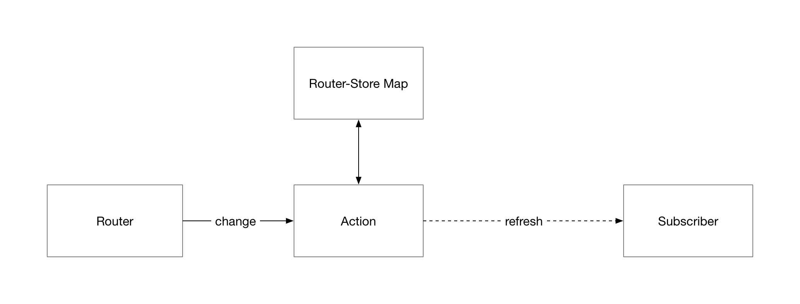

# 完全用websocket通讯的基于nodejs的web系统框架

## Introduction

### Background

目前websocket在web上的应用主要有实时聊天、实时监控、游戏等，而且只有很少部分接口采用。例如在线聊天web应用中，只有聊天消息部分采用，其他部分依然采用http去实现，因为http请求实现起来相对简单，除了聊天消息之外的部分对实时要求不是很高，当所有数据都通过websocket去获取的时候，数据维护相对会更加复杂，而且web应用是多页面的话，websocket的意义并不是很大。

### Motivation

如果在不增加太多开发复杂度的情况下全站采用websocket实现，web的体验会提高很多，尤其是在当前单页应用的趋势下，用户不需要刷新和跳转页面就可以完成几乎所有的操作，再结合websocket技术，实现客户端、服务端全双工通讯，web体验更加接近app。

在这种单页应用+websocket模式下，一个页面就完成所有功能，前后端只需要建立一个websocket链接就可以完成所有的数据交互。对于一个web应用，需要交互的数据一般比较复杂，种类比较多，这个时候用websocket进行数据通讯会增加开发工作，这个时候就需要一个合理的框架解决底层问题，进行合理的抽象和封装操作，从而大大降低开发工作量，保证系统的可靠性。如果框架规划完善，将会带来一个全新高效的web开发模式。

### Current Methods

- HTTP
- 轮询
- 局部使用websocket

### Contributions

我所我打算实现一个完全基于websocket通讯的框架，简化websocket的开发，让开发者可以只关注数据模型的情况下就可以完成应用开发。

1.	全新的web开发模式，不需要约定繁琐的http请求接口
2.	降低websocket的开发复杂度
3.	前后端可以主动推送数据
4.	数据交互速度更快，更加节约资源
5.	能够更加简单快速的开发出适合更多场景的web应用，甚至是app应用

## Related Work

### B/S

### websocke

## Our framework

### Architecture

##### 客户端架构

##### 服务端架构

### 订阅器

客户端在不同的页面下对数据有不同的实时性要求，所以服务端需要维护一个所有在线用户的store订阅器，从而保证数据的精确、有意义的推送。当对应store发生更新时，服务端需要主动推送更新的数据到这些客户端。

##### 存储结构

存储结构为一个对象数组，每个对象记录一个store以及订阅者数组。

### Message Parse

所有的websocket消息都会经过Message Parse进行解析，构建对应的事件对象

### middleware excute

### 事件模型

服务端接受到的事件模型

type：事件类别

- 私人事件
- 广播事件
- 群组事件

data 数据体

### Process

##### 浏览器主动请求流程

##### 路由与订阅器

客户端需要编写一个路由与store映射关系，每次路由切换时都会查找该映射表，告诉服务端订阅器当前用户的订阅的store。

##### 服务端主动推送流程

